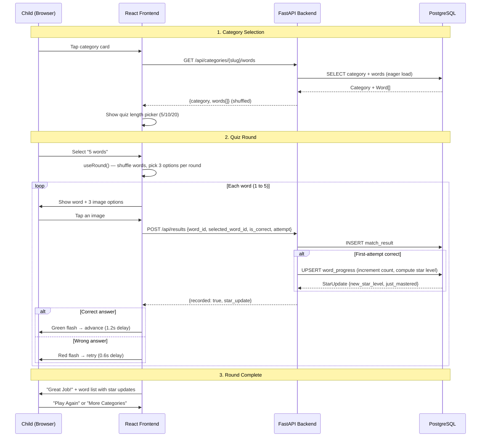
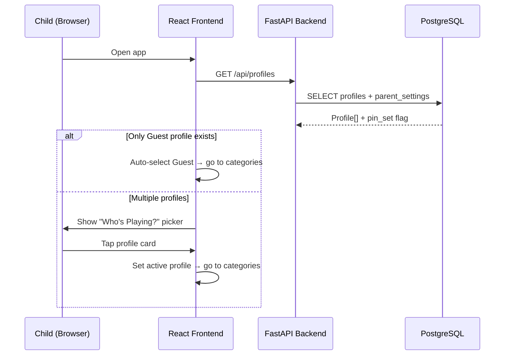
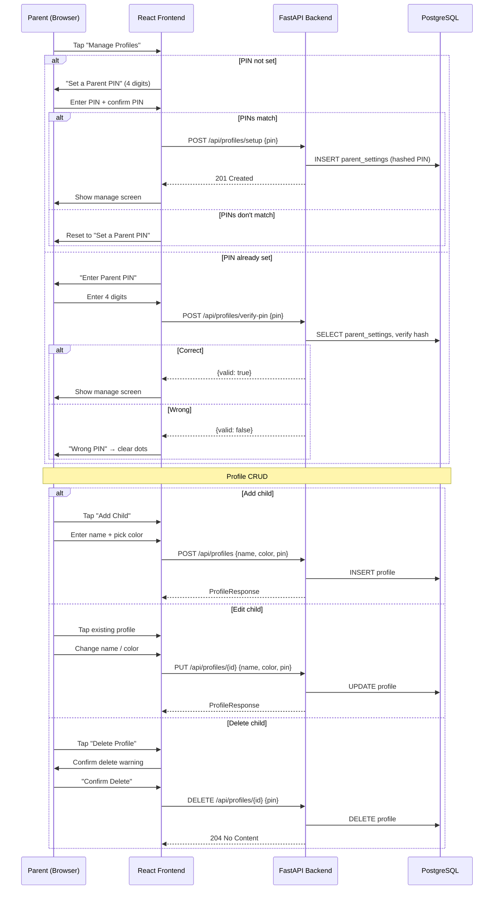
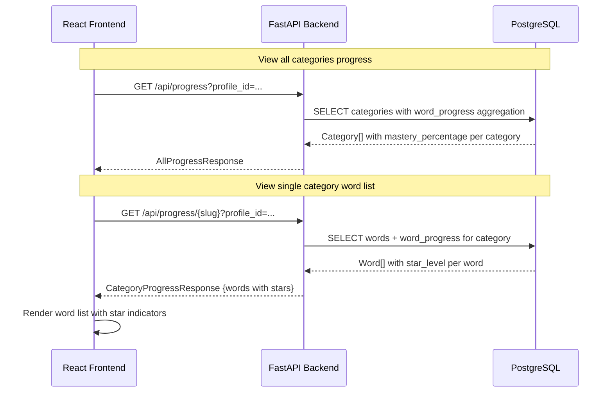
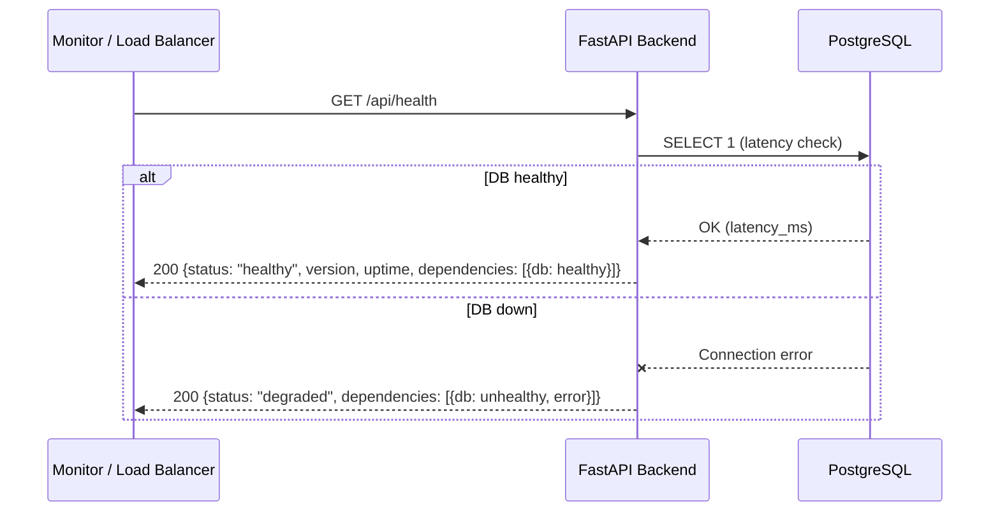
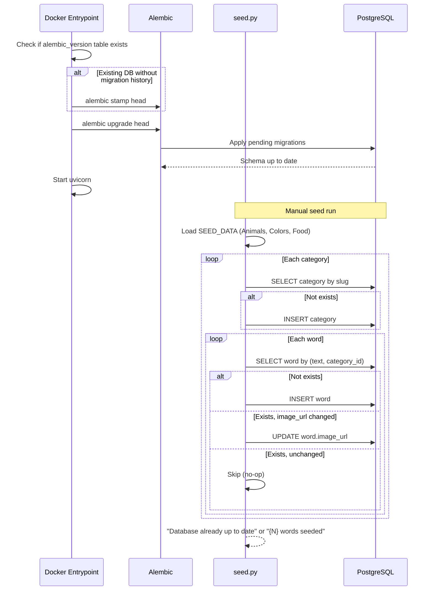

# Sequence Diagrams — Kids Words

Request flow diagrams generated from source code. Updated via `/add:docs`.

## Quiz Round (Core User Flow)

The primary user journey: select a category, pick quiz length, answer word-image matches.

## Profile Selection

How children pick their profile on app load.

## Parent PIN & Profile Management

Parent flow for managing child profiles (PIN-protected).

## Progress Tracking

How the app tracks and displays word mastery.

## Health Check

Infrastructure monitoring endpoint.

## Database Seeding

How the idempotent seed script populates categories and words.

---

*Last updated: 2026-04-12. Generated from source by `/add:docs`. 13 routes across 5 handler groups.*
